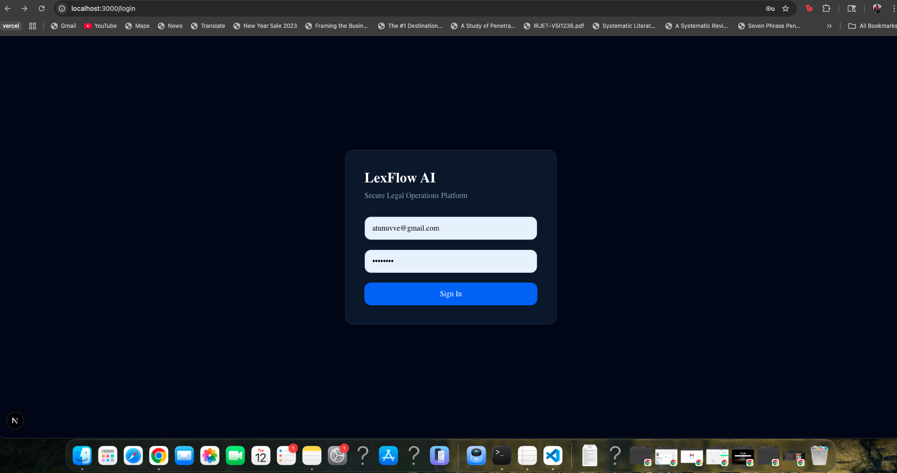
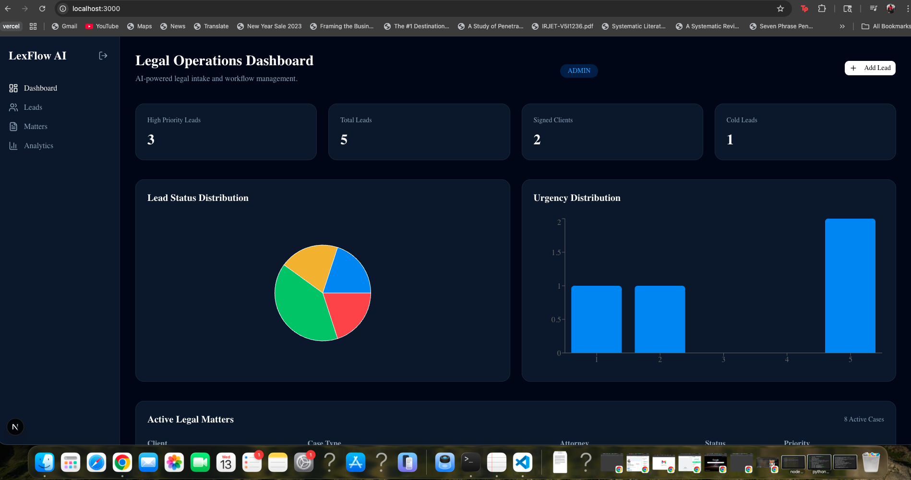
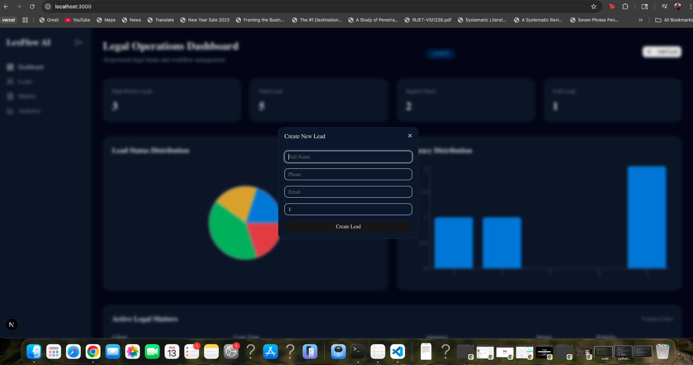
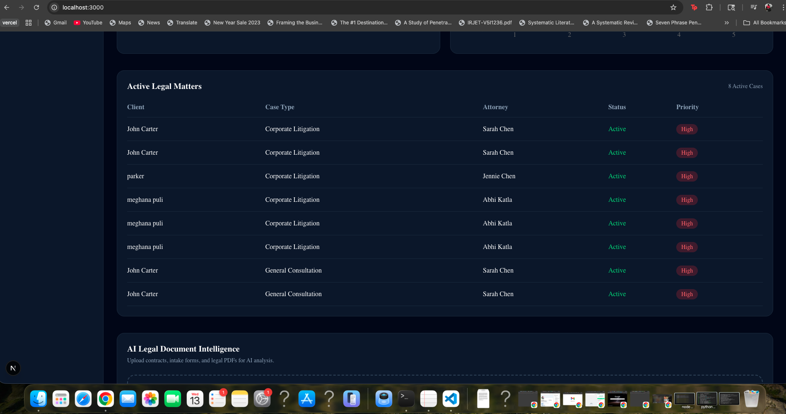
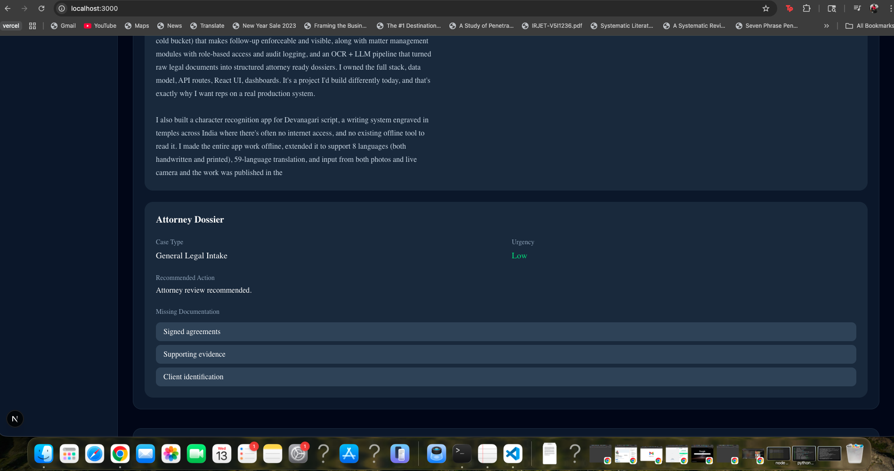
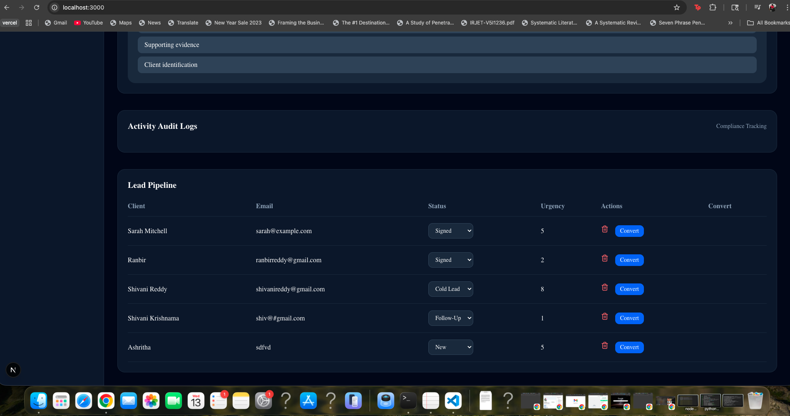

# LexFlow AI

AI-Powered Legal Operations & Intake Intelligence Platform

LexFlow AI is a full-stack enterprise legal operations platform designed to streamline client intake, legal matter management, AI document analysis, and operational workflows for modern law firms.

The platform combines:
- AI-powered intake intelligence
- OCR document processing
- Real-time operational dashboards
- Enterprise authentication systems
- Role-based access control
- Audit compliance logging
- WebSocket realtime infrastructure

---

# Features

# Platform Preview

## Secure Authentication System



---

## Enterprise Legal Operations Dashboard



---

## New Lead Intake Workflow



---

## Active Legal Matters Management



---

## AI Attorney Dossier Generation



---

## Lead Pipeline & Workflow Tracking



## Authentication & Security
- JWT Authentication
- Secure password hashing with bcrypt
- Protected frontend routes
- Role-Based Access Control (RBAC)
- Session management

## Lead Management
- Lead intake dashboard
- AI lead scoring engine
- Dynamic urgency prioritization
- Lead status pipeline
- CRUD operations

## Matter Management
- Legal matter lifecycle management
- Lead-to-matter conversion workflow
- Priority classification
- Attorney assignment

## AI Document Intelligence
- OCR PDF extraction
- AI-generated legal summaries
- Attorney dossier generation
- Missing document detection
- Recommended legal actions

## Realtime Architecture
- FastAPI WebSockets
- Live dashboard updates
- Realtime audit feeds
- Event-driven frontend updates

## Compliance & Observability
- Enterprise audit logging
- Action tracking
- Operational activity feed
- User event monitoring

## Analytics Dashboard
- Lead analytics
- Status distribution
- Urgency visualization
- KPI dashboards
- Interactive charts

---

# Tech Stack

## Frontend
- Next.js
- React
- TypeScript
- Tailwind CSS
- Recharts
- Axios
- react-hot-toast

## Backend
- FastAPI
- Python
- SQLAlchemy
- WebSockets
- JWT Authentication
- bcrypt

## Database
- PostgreSQL

## AI / OCR
- PyMuPDF
- AI heuristic analysis
- Document intelligence workflows

---

# System Architecture

```text
Next.js Frontend
        ↓
FastAPI Backend
        ↓
SQLAlchemy ORM
        ↓
PostgreSQL Database

+ JWT Authentication
+ RBAC
+ OCR Pipelines
+ AI Lead Scoring
+ WebSockets
+ Audit Logging
+ Realtime Updates
```

---

# Realtime Features

LexFlow AI includes enterprise-grade realtime infrastructure using WebSockets.

Realtime events include:
- Lead creation
- Matter conversion
- Audit log updates
- AI processing notifications
- Live dashboard synchronization

---

# AI Lead Scoring

The platform includes a custom AI-driven intake prioritization engine that automatically scores legal leads based on:
- urgency
- contact completeness
- keyword heuristics
- case indicators

This enables:
- intelligent intake prioritization
- conversion optimization
- workflow automation

---

# Getting Started

## Backend Setup

```bash
cd backend

pip install -r requirements.txt

uvicorn app.main:app --reload
```

Backend runs on:
```text
http://127.0.0.1:8000
```

---

## Frontend Setup

```bash
cd frontend

npm install

npm run dev
```

Frontend runs on:
```text
http://localhost:3000
```

---

# API Documentation

FastAPI Swagger docs:

```text
http://127.0.0.1:8000/docs
```

---

# Key Enterprise Features

- JWT Authentication
- Role-Based Access Control
- Audit Logging
- WebSocket Infrastructure
- AI Workflow Automation
- OCR Processing
- Realtime SaaS Architecture
- Enterprise Dashboard Systems

---

# Future Improvements

- Semantic AI Search
- LLM-powered legal assistant
- Multi-tenant architecture
- Cloud deployment
- Docker orchestration
- CI/CD pipelines
- AWS infrastructure
- Vector database integration
- AI recommendation systems

---

# Author

Shivani Reddy

Built as an enterprise-grade AI legal operations platform focused on realtime workflows, intelligent intake systems, and scalable SaaS architecture.
